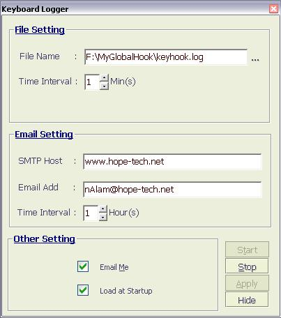



## Global KeyLoger

### Description

It can log every key you pressed. Its great. You cant hide any key. It can run as system start. It can run in invisible mode. It return the Caption name of window with time. With this you can save the logged key after a specific time interval and also the nice thing is that it can mail the logged key after a specific time interval. By the way, For the first time, it shows itself to collect some information, however for the next time, it run in invisible mode. To make it visible press CTRL + F12.

However dont forget to rate it.... bye...
 
### More Info
 
For the first time, it shows itself to collect some information, however for the next time, it run in invisible mode. To make it visible press CTRL + F12.

If you unload the form using stop button in VB it may crach.

             |
---                |---
**Submitted On**   |2002-11-16 04:48:02
**By**             |[Blue Eyes](https://github.com/Planet-Source-Code/PSCIndex/blob/master/ByAuthor/blue-eyes.md)
**Level**          |Intermediate
**User Rating**    |5.0 (25 globes from 5 users)
**Compatibility**  |VB 4\.0 \(32\-bit\), VB 5\.0, VB 6\.0
**Category**       |[Coding Standards](https://github.com/Planet-Source-Code/PSCIndex/blob/master/ByCategory/coding-standards__1-43.md)
**World**          |[Visual Basic](https://github.com/Planet-Source-Code/PSCIndex/blob/master/ByWorld/visual-basic.md)
**Archive File**   |[Global\_Key14980811162002\.zip](https://github.com/Planet-Source-Code/blue-eyes-global-keyloger__1-40753/archive/master.zip)

